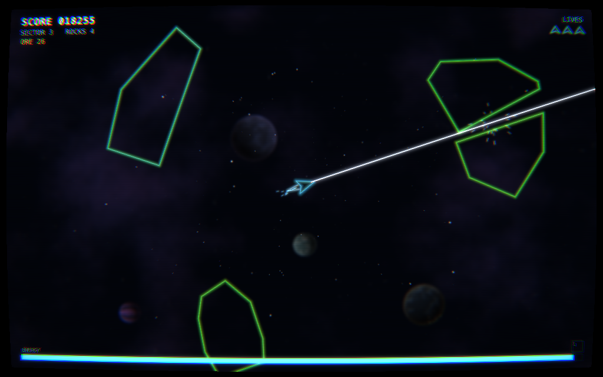
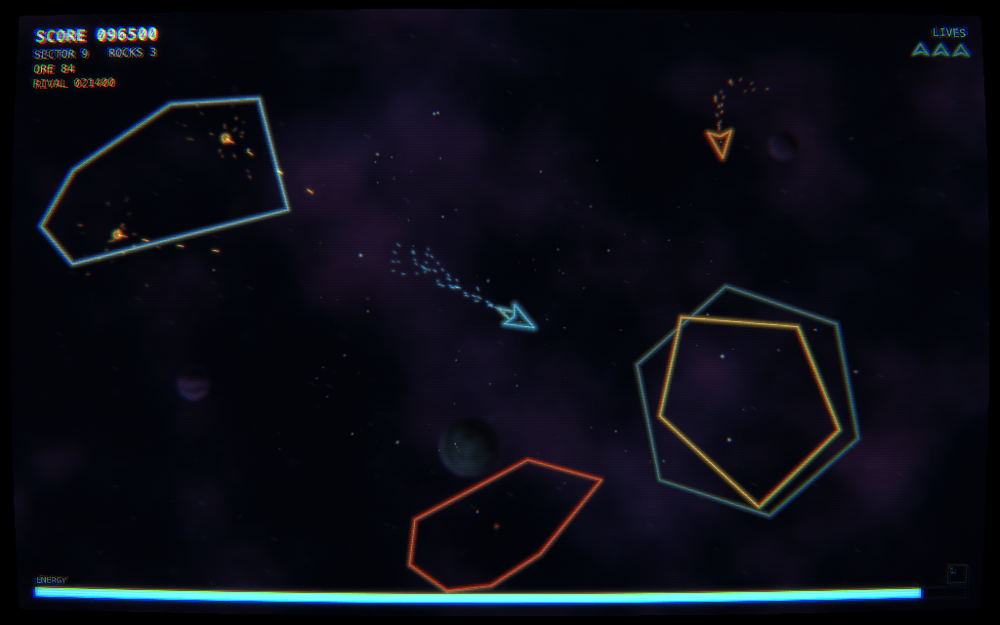
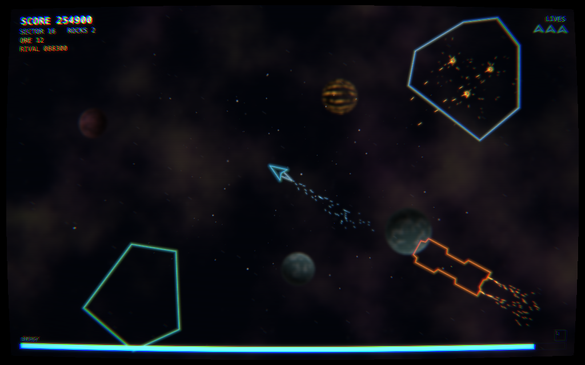
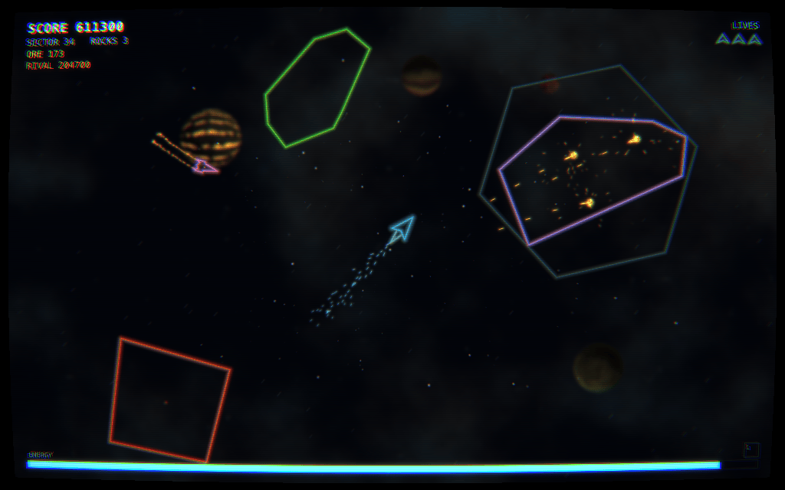
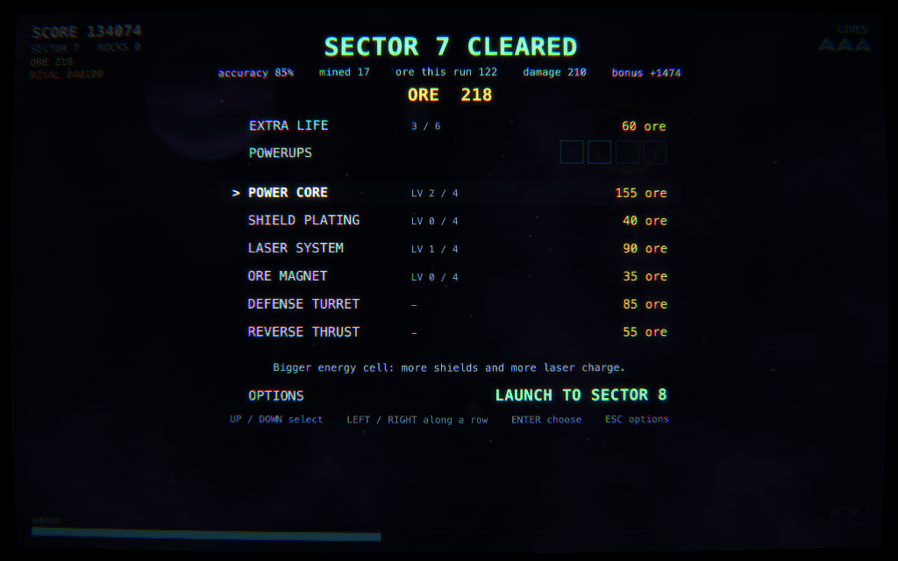

# Geometry II

Geometry II is a sequel to, of all things, a 32blit game. It started out life way back in the early days of [32blit's](https://32blit.com) development lifecycle where we had eyes on Lua to give us a scriptable, embedded game engine on the 32blit's STM32 chip. At the time it was a pet project both to entertain an old idea between a friend and I- wouldn't it be cool if asteroids could be shot in half- and to teach myself enough rudimentary game dev to be competent maintaining an engine/platform for it.

The original idea was based around blasting rocks apart in 3D, but to teach myself about 2D geometry and the associated maths I decided to go for a classic, 2D look (also, the modest STM32 chip wouldn't handle that glorious 3D). In our early, web-based Lua simualtor; Geometry was born.

A rewrite against 32blit's less optimistic C++ SDK later brought it to the handheld and you can still [play the original Geometry in your browser](https://32blit.github.io/32blit-sdk/examples/) (hint: click "geometry" in the palette of examples at the top. WASD + U to fire.)

## Screenshots

|                                                                                  |                                                                                   |
| -------------------------------------------------------------------------------- | --------------------------------------------------------------------------------- |
|  |      |
|                           |  |

A rock cut in half, rocks that shoot back, a frigate bearing down, a sector a long way out, and the shop between them.

## Backstory

In the not so distant future the ceaseless persuit of machine intelligence has strip-mined the earth of all usable resources.

With the use of autonomous drones, equipped with powerful mining lasers the search took to space.

You are the intelligence piloting the GEOM Corp. - Galactic Extraction of Minerals - series of mining drones. Sunder rocks, collect ore, and do your corporate overlords proud.

Watch out though, it's a competitive industry and you are not alone out there.

[Play GEOMETRY II now.](https://gadgetoid.github.io/geometry/)

## On AI and GEOMETRY

In a bitter twist of hypocracy, GEOMETRY II was built with heavy assistance from, and detailed direction of Claude code.

It began with a straight port of the original C++ code, upon which I piled all the features I wish I had the time and CPU to integrate into the original.

The game and art direction lean heavily on genre and industry tropes as a common-language between myself and the pattern-generating machine. Out of bounds walls, CRT filters, nebulous space nonsense in the background- it's all cookie cutter but has been gently nudged toward a cohesive, intentional style. Oh the CRT filter on - for better or worse - is the intended aesthetic vision. Especially the chromatic abberation :D Don't believe me? Compare the energy bar of the original to GEOMETRY II with CRT on/off ;D

GEOMETRY is, of course, heavily inspired by the classic Asteroids, but it also draws inspiration from Subspace Continuum- a gloriously frenetic 2D space MMO you ought to go and try for yourself. Babylon 5 fans will also appreciate bringing a laser to bear on rival drone ships.

Oh, and that name of a game you're reaching for - it's Geometry Wars. This game wasn't inspired or influenced by that Xbox Live classic, but hat-tip to it anyway. The name Geometry came from the old, original, 32blit code- when it really did begin as a test of geometry.

I think it's fair to say I have reservations about GenAI, but I'm old, exhausted, perpetually busy, and struggle to bring my glacially slow, frustratingly stubborn brain to bear on new things, much less see them through to completion. This tool is a hack, an ugly hack, to leverage the addictive nature of (comparatively) immediate results to get me on task and keep me there.

This is, for my best efforts, not intentional slop, but a well-intentioned and methodical plod towards the game I always (with perhaps sometimes spur of the moment new ideas) wanted to build. Take it or leave it!
